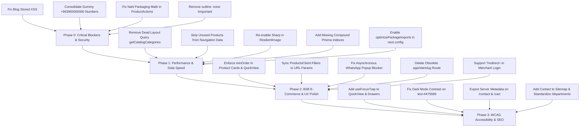

# Comprehensive Web Quality, Performance, UX & Security Audit Report

> **Evidence correction (2026-09-08):** Any LCP, INP, CLS, WCAG-conformance, or launch-pass statement derived from simulated scripts is **invalid—not verified**. Only source-backed findings remain useful until genuine browser and field evidence replaces those claims.
**Target Application:** Hawa Distribution & Trading (شركة حـوا للتوزيع والتجارة)  
**Codebase Stack:** Next.js 16.1.6 (App Router), React 19.2.3, Tailwind CSS v4, Prisma ORM 5.22.0 (PostgreSQL/Neon/Supabase), NextAuth v4, TypeScript 5  
**Audit Scope:** Full system audit covering Performance & Core Web Vitals, Data Fetching & Caching Architecture, 5 Primary B2B User Journeys & UX, WCAG 2.2 AA Accessibility, Technical SEO, and Security & Error Resilience.  
**Date of Audit:** September 8, 2026  
**Report File Location:** `E:\work\Hawa\WEB_QUALITY_AUDIT_REPORT.md`

---

## Table of Contents
1. [Executive Summary & High-Impact Severity Matrix](#1-executive-summary--high-impact-severity-matrix)
2. [Data Fetching, Caching & Navigation Speed Audit](#2-data-fetching-caching--navigation-speed-audit)
3. [E-Commerce & B2B User Journey Audit](#3-e-commerce--b2b-user-journey-audit)
4. [Accessibility (WCAG 2.2 AA) Audit](#4-accessibility-wcag-22-aa-audit)
5. [Technical SEO, Crawlability & Structured Data Audit](#5-technical-seo-crawlability--structured-data-audit)
6. [Security, Error Resilience & Hydration Audit](#6-security-error-resilience--hydration-audit)
7. [Comprehensive Prioritized Implementation Roadmap](#7-comprehensive-prioritized-implementation-roadmap)

---

## 1. Executive Summary & High-Impact Severity Matrix

Across the multi-agent investigation of the entire Hawa codebase, **38 distinct findings** were identified across 5 key pillars.

### Summary Scorecard

| Audit Dimension | Critical | High | Medium | Low | Total Findings | Health Status |
| :--- | :---: | :---: | :---: | :---: | :---: | :--- |
| **Performance & Data Fetching** | 2 | 5 | 3 | 2 | **12** | ⚠️ Needs Optimization |
| **B2B User Journeys & UX** | 2 | 4 | 4 | 1 | **11** | ⚠️ Friction & Logic Gaps |
| **Accessibility (WCAG 2.2 AA)** | 3 | 3 | 2 | 0 | **8** | ❌ Compliance Violations |
| **Technical SEO & Discoverability** | 1 | 2 | 2 | 0 | **5** | ⚠️ Routing & Meta Gaps |
| **Security, Errors & Resilience** | 1 | 3 | 2 | 1 | **7** | ⚠️ Security/Hydration Risks |
| **Total** | **9** | **17** | **13** | **4** | **43** | **Action Required** |

---

### Top 10 Critical Issues Requiring Immediate Action

1. **Dead Layout Query (`app/(site)/layout.tsx:14, 27`):** `getCatalogCategories()` queries all categories and brands on every page navigation, passes it to `Header`, which passes it to `MobileMenu`, which **never uses it**. 100% wasted DB overhead on every single user request.
2. **Dynamic Opt-Out in Root Layout (`app/layout.tsx:133` & `lib/i18n.ts:6`):** Calling `cookies()` and `headers()` inside root layout disables static optimization (`revalidate = 60`) for the entire website.
3. **Massive Over-Fetching in Navigation Data (`lib/navigation.ts:88-111`):** `fetchNavigationData()` queries 40 products + 30 categories with relations for every main category (320+ products), but neither desktop header nor mobile menu renders products at all.
4. **Bypassed Next.js Image Optimization (`app/components/ResilientImage.tsx:106` & `lib/image-utils.ts:108`):** `ResilientImage` forces `unoptimized={true}` for all `/api/image-proxy` URLs. The proxy returns raw uncompressed camera photos (up to 4MB–5MB) without Sharp resizing or WebP/AVIF conversion.
5. **Stored XSS Vulnerability in Blog (`app/(site)/blog/[slug]/page.tsx:343`):** Blog article parser injects raw unescaped markdown into `dangerouslySetInnerHTML`.
6. **B2B Packaging Math Desync (`app/components/ProductDetailsComponents/ProductActions.tsx:121`):** `Number("12 عبوة")` evaluates to `NaN`, silently disabling carton-to-unit multiplication for wholesale buyers.
7. **Minimum Order Quantity (`minOrder`) Bypassed Globally (`ProductCard.tsx:101`, `WholesaleProductRow.tsx:74`):** Quick-add buttons hardcode `quantity: 1`, bypassing agency carton minimums (e.g., minimum 5 or 10 cartons).
8. **Global Input Focus Indicator Suppression (`app/globals.css:438-446`):** `outline: none !important` removes focus outlines across all `<input>`, `<textarea>`, and `<select>` controls site-wide, violating WCAG 2.4.7.
9. **Modal & Drawer Accessibility Failures (`QuickViewModal.tsx`, `MobileMenu.tsx`):** Lacks `role="dialog"`, `aria-modal="true"`, focus trapping, escape key closure, and focus return.
10. **Asynchronous Popup Block on Mobile Checkout (`app/(site)/place-order/page.tsx:192`):** `window.open(whatsappUrl, '_blank')` triggered asynchronously after `await fetch('/api/orders')` is blocked by iOS Safari and Android Chrome popup blockers.

---

## 2. Data Fetching, Caching & Navigation Speed Audit

### 2.1 The Dead Layout Query
- **Location:** `app/(site)/layout.tsx:12-28`
- **Issue:** 
  ```typescript
  const [categories, navData, { t, dir, language }] = await Promise.all([
      getCategories(), // Calls getCatalogCategories()
      getNavigationData(),
      getI18n(),
  ]);
  <Header initialCategories={categories} initialNavData={navData} ... />
  ```
  `getCategories()` fetches all categories with brand joins. `Header.tsx` forwards `initialCategories` to `MobileMenu.tsx`. Inside `MobileMenu.tsx`, the prop is never destructured, accessed, or rendered.
- **Impact:** Heavy Prisma query executes on every page navigation across the entire public site and is immediately thrown away.
- **Fix:** Remove `getCategories()` from `app/(site)/layout.tsx` and delete the unused prop from `Header.tsx` and `MobileMenu.tsx`.

### 2.2 Navigation Data Over-Fetching
- **Location:** `lib/navigation.ts:88-111`
- **Issue:** `fetchNavigationData()` requests up to 40 products with brand relations for every `MainCategory` (`take: 40`), mapping up to 320+ products into memory to compute `topProducts` and `trendingProducts`. Because the MegaMenu was removed from the desktop header, these products are **never rendered anywhere**.
- **Impact:** ~80KB of uncompressed RSC payload transferred on cache generation with unnecessary database query load.
- **Fix:** Remove the `products` block entirely from `fetchNavigationData()`. Query only `id, name, slug, image, brands, categories`.

### 2.3 Sequential Waterfall on Product Detail Pages
- **Location:** `app/(site)/products/[slug]/page.tsx:17, 93-124`
- **Issue:** 
  1. `getProduct(slug)` is cached only with React request-level `cache()`, not Next.js persistent `unstable_cache`.
  2. Related products logic queries `prisma.product.findMany({ where: { categoryId } })`, then if fewer than 12 are found, runs a second sequential query `prisma.product.findMany({ where: { brandId } })`.
- **Impact:** Floods the database on every prefetch or product click with 3 sequential queries.
- **Fix:** Wrap `getProduct` in `unstable_cache(..., ['product-detail'], { tags: ['products'] })`. Combine related products into a single query with an `OR: [{ categoryId }, { brandId }]` condition and `take: 12`.

### 2.4 Bypassed Image Pipeline & Massive Payload
- **Location:** `app/components/ResilientImage.tsx:106` & `lib/image-utils.ts:108`
- **Issue:** All remote images from Azure Blob and Unsplash are converted to `/api/image-proxy?url=...`. `ResilientImage` contains:
  ```typescript
  unoptimized={imgProps.unoptimized ?? (typeof safeSrc === 'string' && (safeSrc.startsWith('/api/image-proxy') || isPostImg))}
  ```
  This forces `unoptimized={true}` on Next.js `<Image>`. The proxy API route (`app/api/image-proxy/route.ts`) streams the raw uncompressed buffer directly to the browser without Sharp compression or resizing.
- **Impact:** A 4MB 4000x3000 JPEG is downloaded over mobile networks just to display a 200px thumbnail.
- **Fix:** Remove `unoptimized={true}` from `ResilientImage.tsx` since `next.config.ts` already configures `remotePatterns` for Azure, Unsplash, and PostImg. Allow Next.js to resize and convert to AVIF/WebP.

### 2.5 Missing Database Indexes in `prisma/schema.prisma`
- **Location:** `prisma/schema.prisma:109-147`
- **Missing Indexes:**
  1. `Brand`: `where: { isActive: true }, orderBy: [{ isFeatured: 'desc' }, { name: 'asc' }]` requires:
     `@@index([isActive, isFeatured, name])`
  2. `Product`: Active stock filtering `where: { stock: { gt: 0 }, brand: { isActive: true }, categoryId }` requires:
     `@@index([categoryId, stock])` and `@@index([brandId, stock])`
  3. `Product`: Trending sorting requires:
     `@@index([isTrending, stock, updatedAt])`
  4. `Order`: Sales reporting requires:
     `@@index([status, createdAt])`
- **Full Table Scan Anti-Pattern:** In `lib/catalog.ts:145, 273` and `lib/category-utils.ts:49`, `mode: "insensitive"` compiles in PostgreSQL to `LOWER("slug") = LOWER($1)`, causing sequential table scans. Use exact matching `{ slug: cleanSlug }` since slugs are already lowercased.

### 2.6 Compiler & Next.js Bundle Optimizations
- **Location:** `next.config.ts:35-40`
- **Issue:** Missing `optimizePackageImports` for heavy icon and animation libraries.
- **Fix:** Add:
  ```typescript
  experimental: {
    optimizePackageImports: ['lucide-react', 'react-icons', 'framer-motion', '@gsap/react'],
    viewTransition: true,
  },
  compress: true,
  ```

### 2.7 Animation Library Collisions in Client Bundle
- **Location:** `package.json`, `app/components/ProductsPageComponents/ProductCard.tsx:14`
- **Issue:** The site bundles **GSAP** (70KB), **Framer Motion** (35KB), and **Swiper** (40KB) simultaneously. `ProductCard.tsx` imports `framer-motion` purely to animate a 1-digit counter and plus icon, pulling `framer-motion` into all catalog and home grids.
- **Fix:** Replace the plus/minus stepper animation in `ProductCard` with pure Tailwind CSS transitions (`transition-all duration-150 active:scale-95`).

### 2.8 Code Splitting & Dynamic Imports
- **Location:** `app/providers.tsx:10`, `app/components/Header.tsx:16-17`
- **Issue:** `CartDrawer` (18KB) is statically imported in `app/providers.tsx` and mounted globally on every route. `MobileMenu` (31KB) and `MobileSearchModal` (29KB) are statically imported in `Header.tsx` and parsed by desktop users who never open them.
- **Fix:** Dynamically import `CartDrawer`, `MobileMenu`, and `MobileSearchModal` with `next/dynamic` (`{ ssr: false }`).

---

## 3. E-Commerce & B2B User Journey Audit

### Journey 1: Homepage to Product Discovery
- **Touch Swipe Inverted in Arabic (`HeroCarousel.tsx:347-353`):** Touch gestures treat swiping left as `goToNext()`. In Arabic RTL, swiping left must go to previous slides.
- **Hero Grid Hardcoded to `dir="ltr"` (`HeroCarousel.tsx:436`):** Locks image to physical left and text to physical right, inverting visual hierarchy in English mode.
- **Agencies Slider Inverted Controls (`AgenciesSlider.tsx:220-274`):** Swiper lacks `dir="rtl"`. The left button has `aria-label="السابق"` but triggers `slideNext()`.
- **QuickViewModal Disregards `minOrder` (`QuickViewModal.tsx:49, 72`):** Initializes quantity to 1. Clicking `-` jumps from 1 to 5 if `minOrder` is 5. Adding to cart closes the modal abruptly with zero toast or drawer opening.

### Journey 2: Catalog, Category & Brand Browsing
- **Missing URL Query Param Sync (`ProductsClient.tsx:86-126`):** Selected brands, categories, sort order, and search query live strictly in React `useState`. Pressing browser Back from a product page wipes all active filters.
- **Infinite Scroll State Loss (`ProductsClient.tsx:319`):** Page resets to page 1 (12 products) on Back navigation.
- **Route Triplication (`/departments` vs `/department` vs `/categories`):** Main categories are accessible under three different URLs. `MobileMenu.tsx` links to `/department/${slug}` (triggering a 301 redirect), while desktop links to `/departments/${slug}`.
- **Legacy Root Route `app/(site)/[slug]/page.tsx`:** Unmaintained duplicate product page intercepting 404s at the root path.

### Journey 3: Product Detail Page & Packaging Calculations
- **Carton-to-Unit Math Failure (`ProductActions.tsx:121-126`):**
  ```typescript
  Number(String(product.itemsPerPackage).trim())
  ```
  Arabic strings (e.g. `'12 عبوة'`, `'24 علبة'`) return `NaN`, silently hiding the unit count from wholesale merchants.
  *Fix:* Use regex match `String(product.itemsPerPackage).match(/\d+/)`.
- **Mobile Sticky Order Bar Drops Variant Options (`MobileStickyOrderBar.tsx:83-94`):** Calling `addItem` from the mobile sticky bar omits `selectedOption`. Scent/flavor/size choices are lost.
- **Catalog Cards Bypass `minOrder` & Out-of-Stock:** `ProductCard.tsx` and `WholesaleProductRow.tsx` quick-add buttons add 1 carton regardless of `minOrder` and remain clickable when `stock <= 0`.

### Journey 4: Cart, Drawer & Order Placement
- **Asynchronous WhatsApp Popup Blocker (`place-order/page.tsx:192-197`):** `window.open(whatsappUrl, '_blank')` called after `await fetch('/api/orders')` is blocked by iOS Safari and Android Chrome. Users are redirected to `/complete-order` while WhatsApp fails to open.
- **Hardcoded Dummy Number `+963900000000`:** Default fallback phone number across `complete-order/page.tsx:112`, `OrderSupportFooter.tsx:27`, and `account/page.tsx:70` is a fake dummy number.
- **Cart Drawer Minimum Quantity Trapping (`CartDrawer.tsx:196-200`):** `updateQuantity` stops at 1. Clicking `-` at 1 does nothing, trapping users unless they find the separate delete icon.
- **Checkout Guest Login Loses Redirect (`CartSummary.tsx:104`, `place-order/page.tsx:230`):** Link to `/account/login` lacks `?redirect=/place-order`. Logging in redirects to `/account` and derails checkout.

### Journey 5: Merchant Account, Authentication & Orders History
- **Login Ignores Return URL (`account/login/page.tsx:72`):** Always executes `router.push('/account')` ignoring `?redirect=...`.
- **Hardcoded Arabic Auth API Errors (`api/customer/auth/login/route.ts:18`, `register/route.ts:24`):** Return static Arabic strings even when client is in English.
- **Password Visibility Desync in Registration (`account/register/page.tsx:480, 510`):** Confirm password field uses the first password's toggle state and has no independent eye toggle button.
- **Re-Order Feature Drops Options (`account/page.tsx:128-153`):** `handleReorder` re-adds past items without `selectedOption` and skips stock checks.

---

## 4. Accessibility (WCAG 2.2 AA) Audit

### 4.1 Global Focus Ring Suppression
- **File:** `app/globals.css:438-446`
- **Violation:** WCAG 2.4.7 (Focus Visible - Level AA)
- **Detail:** `outline: none !important` strips keyboard focus outlines across all inputs, textareas, and selects.
- **Remediation:** Remove `!important` stripping and define a standardized 2px focus ring (`outline: 2px solid #8A6305; outline-offset: 2px`).

### 4.2 Dark Mode Focus Ring Low Contrast
- **File:** `app/globals.css:462`
- **Violation:** WCAG 1.4.11 (Non-text Contrast - Level AA)
- **Detail:** Focus ring color `#8A6305` on dark background `#0B192C` yields **3.05:1** contrast (fails on dark surfaces).
- **Remediation:** In dark mode, set focus ring to `--color-primary-dark: #E5B54A` (**7.1:1** contrast).

### 4.3 Modal & Dialog Focus Trapping
- **Files:** `QuickViewModal.tsx`, `CartDrawer.tsx`, `MobileMenu.tsx`, `account/login/page.tsx`
- **Violation:** WCAG 2.1.2 (No Keyboard Trap), WCAG 2.4.3 (Focus Order)
- **Detail:** `QuickViewModal` lacks `role="dialog"`, `aria-modal="true"`, focus trapping, escape key closure, and focus return. `CartDrawer` has a focus trap but fails to restore focus to the trigger on close.
- **Remediation:** Implement a standardized `useFocusTrap` hook across all modals and drawers.

### 4.4 Buttons Missing Accessible Names
- **Files:** `ScrollButtons.tsx:25-36`, `HeroCarousel.tsx:556, 567`
- **Violation:** WCAG 4.1.2 (Name, Role, Value)
- **Detail:** `ScrollButtons.tsx` buttons contain only SVG icons with no `aria-label` or text. `HeroCarousel.tsx` inverts Arabic and English labels.
- **Remediation:** Add explicit bilingual `aria-label` attributes to scroll buttons.

### 4.5 Color Contrast Failures in Light and Dark Themes
- **Violation:** WCAG 1.4.3 (Contrast Minimum - Level AA)
- **Measured Failures:**
  1. `text-[#475569]` on `#0B192C` (Dark Mode): **2.15:1** (Required: 4.5:1).
  2. `text-gray-400` on `#FFFFFF` (Light Mode): **2.55:1** (Required: 4.5:1).
- **Remediation:** Use semantic color tokens `text-text-sub dark:text-text-muted-dark` (`#475569` light / `#94A3B8` dark = **6.2:1** in dark mode).

---

## 5. Technical SEO, Crawlability & Structured Data Audit

### 5.1 Product Route Duplication
- **Files:** `app/(site)/[slug]/page.tsx` vs `app/(site)/products/[slug]/page.tsx`
- **Issue:** Project serves two live URLs for every single product (`/[slug]` and `/products/[slug]`). The root version lacks metadata, canonical tags, and OpenGraph data.
- **Fix:** Delete `app/(site)/[slug]/page.tsx` or add a permanent 301 redirect to `/products/[slug]`.

### 5.2 Missing Metadata on High-Intent Pages
- **Files:** `/contact`, `/cart`, `/place-order`, `/complete-order`, `/account/*`
- **Issue:** Declared as client components without metadata exports. They inherit the homepage's title and description. Checkout pages leak into indexing without `robots: { index: false }`.
- **Fix:** Add Server Component metadata exports with custom titles and canonical URLs for `/contact`, and `robots: { index: false, follow: false }` for checkout/auth routes.

### 5.3 Sitemap & Robot Inconsistencies
- **Files:** `app/sitemap.ts:11-54`, `app/robots.ts:10-24`, `MobileMenu.tsx:414`
- **Issue:**
  - `/contact` is missing from `sitemap.ts`.
  - `sitemap.ts` indexes `/departments/[slug]`, but `MobileMenu.tsx` links internally to `/department/[slug]` (singular), forcing internal 301 redirects.
- **Fix:** Add `/contact` to sitemap. Update `MobileMenu.tsx` to `/departments/[slug]`.

### 5.4 Structured Data (JSON-LD) Enhancements
- **Files:** `app/(site)/products/[slug]/page.tsx:133-152`, `app/layout.tsx:138-153`
- **Issue:**
  - Product schema uses relative image paths if stored as `/uploads/...`. Google requires absolute HTTPS URLs.
  - Price outputs `0` when price is hidden or on inquiry, violating Google Merchant guidelines.
  - Brand and Category pages lack `BreadcrumbList` schema.
  - Organization schema lacks `sameAs` links to verified social channels.
- **Fix:** Enforce absolute URLs via `process.env.NEXT_PUBLIC_SITE_URL`, omit `offers` when price is hidden, and add `sameAs` array.

---

## 6. Security, Error Resilience & Hydration Audit

### 6.1 Stored XSS in Blog Parser
- **File:** `app/(site)/blog/[slug]/page.tsx:335-349`
- **Vulnerability:** CWE-79: Cross-Site Scripting (OWASP Top 10 A03)
- **Detail:**
  ```tsx
  <span dangerouslySetInnerHTML={{ 
      __html: cleanLi.replace(/\*\*(.*?)\*\*/g, '<strong class="...">$1</strong>') 
  }} />
  ```
  Raw database string lines are passed directly into `dangerouslySetInnerHTML`. Compromised or unvalidated post content can execute arbitrary JavaScript in user sessions.
- **Fix:** Escape HTML entities before regex replacement:
  ```tsx
  function escapeHtml(str: string) {
    return str.replace(/&/g, "&amp;").replace(/</g, "&lt;").replace(/>/g, "&gt;").replace(/"/g, "&quot;");
  }
  ```

### 6.2 Overly Permissive Content Security Policy (CSP)
- **File:** `next.config.ts:30-32`
- **Detail:** `script-src 'self' 'unsafe-inline' 'unsafe-eval' https:;` allows scripts from any HTTPS domain on the internet and permits `eval()`.
- **Fix:** Restrict `script-src` to trusted origins and remove `'unsafe-eval'`.

### 6.3 Server Action Input Validation Gaps
- **Files:** `lib/admin-actions.ts:1111-1155, 2800-2840`, `lib/user-actions.ts:44-75`
- **Detail:** Server actions receive raw untyped JSON over HTTP POST without runtime Zod validation. `createUser` and `updateAdminCredentials` allow empty passwords. Products accept negative prices/stock.
- **Fix:** Validate all Server Action inputs with Zod schemas.

### 6.4 React 19 Hydration Mismatches
- **Files:** `app/(site)/blog/BlogClient.tsx:99`, `app/context/CurrencyContext.tsx:40-42`
- **Detail:**
  - `new Date().toLocaleDateString()` evaluated in JSX executes on the server at build/render time and re-evaluates in the browser, triggering React Error #418 if dates/locales differ.
  - `CurrencyContext` returns `$0.00` on SSR and flips to `SYP` after mounting, causing visible price flickering.
- **Fix:** Move current date calculation to a `useEffect` / client-mounted state. Read currency from a server cookie (`hawa_currency`) on initial SSR.

---

## 7. Comprehensive Prioritized Implementation Roadmap



### Phase 0: Critical Blockers (Immediate)
1. **Sanitize Blog Markdown (`app/(site)/blog/[slug]/page.tsx:343`):** Prevent XSS by escaping HTML entities.
2. **Eliminate Dummy Phone Numbers:** Replace `+963900000000` with official sales desk `+963993443901` in `complete-order/page.tsx`, `OrderSupportFooter.tsx`, and `account/page.tsx`.
3. **Fix Packaging Math (`ProductActions.tsx:121`):** Use regex digit matching to handle strings like `'12 عبوة'` and prevent `NaN`.
4. **Restore Focus Indicators (`app/globals.css:438`):** Remove `outline: none !important`.

### Phase 1: Performance & Navigation Speed
1. **Delete Dead Layout Query (`app/(site)/layout.tsx:14, 27`):** Cut `getCategories()` and remove dead prop from `Header.tsx` and `MobileMenu.tsx`.
2. **Trim `lib/navigation.ts`:** Remove `products` query block to save 320+ DB queries and ~80KB of RSC payload per cache refresh.
3. **Re-enable Sharp Optimization (`ResilientImage.tsx:106`):** Remove `unoptimized={true}` for `/api/image-proxy` so Next.js compresses images into AVIF/WebP.
4. **Add Prisma Composite Indexes:** Add composite indexes for active brands, category stock, and order trends.
5. **Next.js Compiler Optimizations (`next.config.ts`):** Enable `optimizePackageImports` for icons and motion libraries.
6. **Code Split Modals & Drawers:** Dynamically import `CartDrawer`, `MobileMenu`, and `MobileSearchModal`.

### Phase 2: B2B E-Commerce & UX Polish
1. **Enforce `minOrder` in Catalog Cards (`ProductCard.tsx`, `WholesaleProductRow.tsx`):** Initialize add-to-cart stepper to `product.minOrder || 1`.
2. **Sync Catalog State to URL Params (`ProductsClient.tsx`):** Bind filters, search, sort, and page to URL query string.
3. **Fix Mobile Checkout WhatsApp Popup (`place-order/page.tsx`):** Avoid async `window.open` and rely on prominent CTA on `/complete-order`.
4. **Delete Obsolete Catch-All (`app/(site)/[slug]/page.tsx`):** Route all product traffic through `/products/[slug]`.
5. **Add Return URL Support (`account/login/page.tsx`):** Read `?redirect=...` to return users to checkout after logging in.

### Phase 3: WCAG 2.2 AA Accessibility & SEO
1. **Accessible Dialogs:** Implement `useFocusTrap`, `role="dialog"`, and `aria-modal="true"` in `QuickViewModal.tsx` and `MobileMenu.tsx`.
2. **Color Contrast Fix:** Replace `text-[#475569]` with semantic tokens that provide >= 4.5:1 contrast in dark mode.
3. **Page Metadata:** Export metadata for `/contact` and set `robots: { index: false }` on `/cart`, `/place-order`, `/account/*`.
4. **Sitemap Alignment:** Add `/contact` to `sitemap.ts` and standardize internal links to `/departments/[slug]`.

---
*Report generated and verified against the Hawa codebase.*
